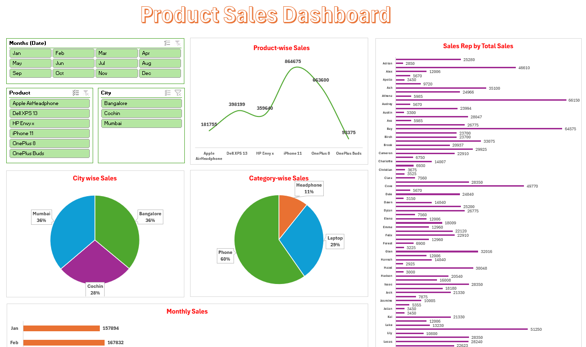

# Product Sales Data

Welcome to the **Product Sales Data** repository! This project contains a comprehensive Excel file designed to analyze and visualize sales data effectively.

---

## 📊 Dashboard

---

## 📂 File Overview

- **File Name:** `Product Sales Data.xlsx`  
- **Contents:**  
    - **Raw Data:** Contains detailed sales records.  
    - **Pivot Tables:** Summarized views for quick insights.  
    - **Dashboard:** Interactive charts and graphs for data visualization.

---

## 📊 Key Features

1. **Raw Data**  
     - Organized and structured sales data for analysis.  
     - Includes columns such as `Date`, `Product`, `Category`, `Sales Rep`, `City`, and much more.

2. **Pivot Tables**  
     - Dynamic tables for summarizing sales by product, city, and time period.  
     - Easy to filter and customize for specific insights.

3. **Dashboard**  
     - Visually appealing charts, including bar graphs, pie charts, and line graphs.  
     - Provides a quick overview of key metrics like total sales, top-performing products, and city-wise performance.

---

## 🛠️ How to Use

1. Open the `Product Sales Data.xlsx` file in Microsoft Excel.  
2. Navigate through the tabs:  
     - **Raw Data:** Explore the detailed dataset.  
     - **Pivot Tables:** Use filters to customize your view.  
     - **Dashboard:** Interact with charts for a high-level summary.  
3. Use the data for reporting, decision-making, or further analysis.

---

## 📌 Requirements

- **Software:** Microsoft Excel 2016 or later (or equivalent software).  
- **Skills:** Basic knowledge of Excel for navigating and interacting with the file.

---

Thank you for using the **Product Sales Data** file! 🚀  